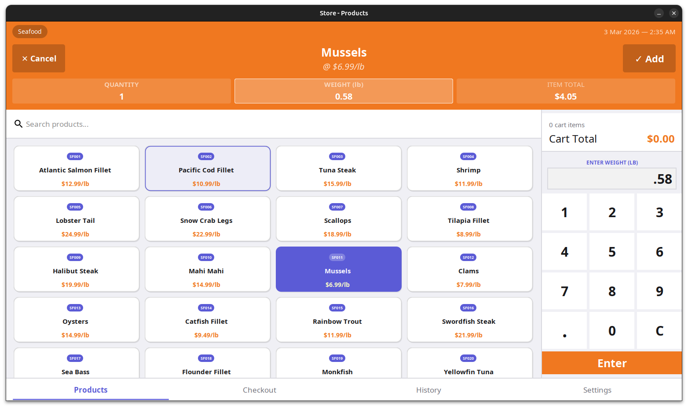
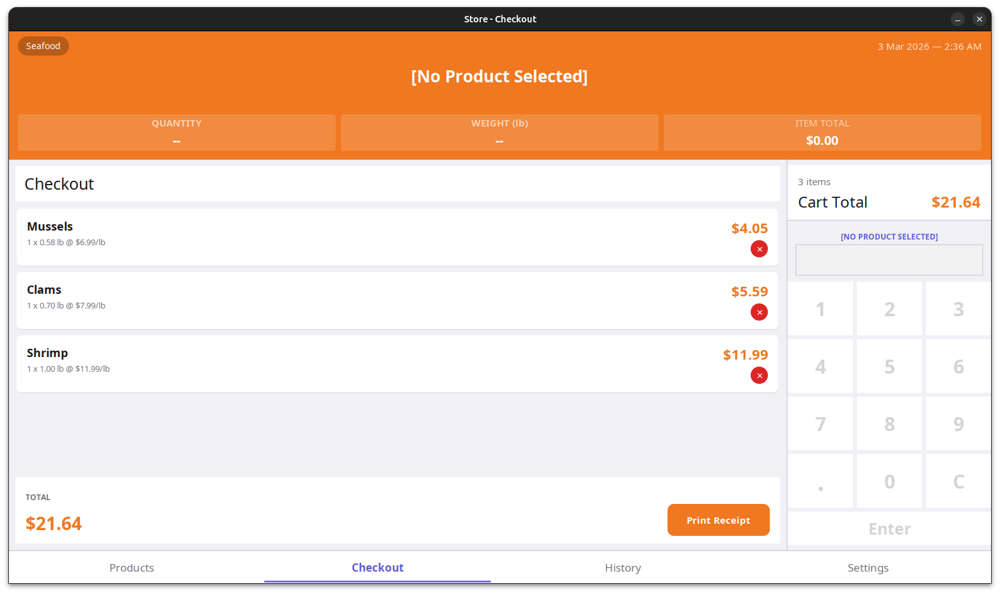
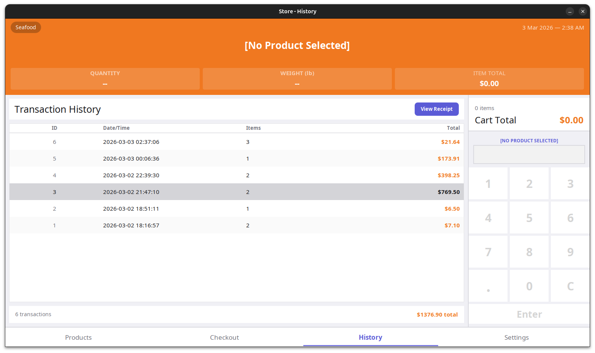
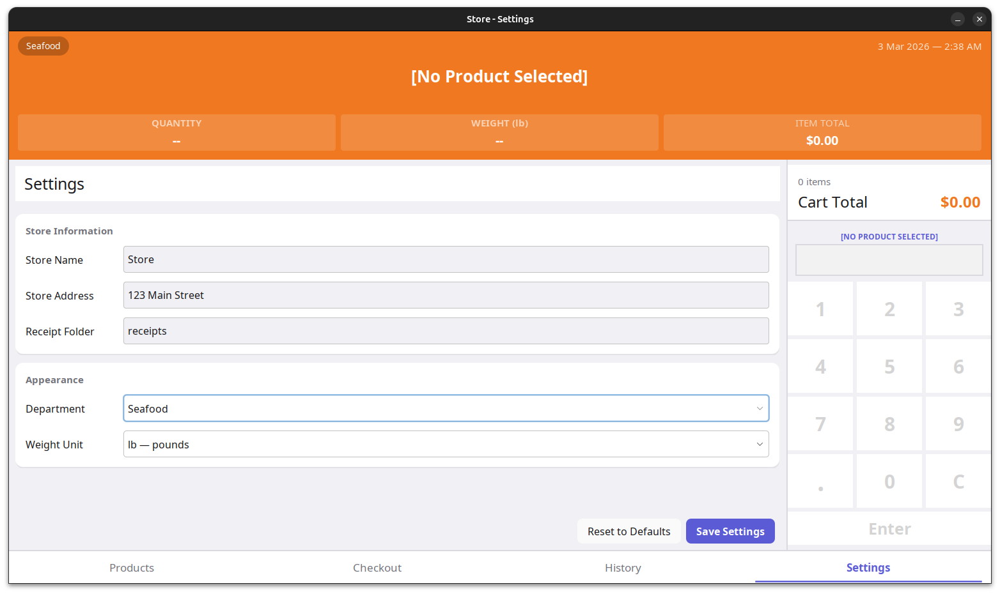

# SimplePOS

A desktop retail application built with Java and Swing to handle grocery sales. The user selects products from a visual catalog and enter weights/quantities to calculate item totals. Every transaction is saved to a local history log and produces a formatted PDF receipt once the sale is finished.

### Purpose
This project served as an exercise with UI design and managing complex states in Java.

### Features
*   **Product Catalog:** A searchable interface for quick item selection.
*   **Transaction Management:** A complete checkout workflow including cart management, total calculations, and receipt generation.
*   **Persistence:** Local SQLite integration to log and review previous transactions.

### Interface
| Product Catalog | Checkout |
| :--- | :--- |
|  |  |

| Transaction History | Settings |
| :--- | :--- |
|  |  |

### Tech Stack
*   **Language:** Java 17
*   **UI Framework:** Java Swing
*   **Database:** SQLite via JDBC
*   **Build Tool:** Gradle
*   **Libraries:** PDFBox, SLF4J

### Installation & Usage

**Prerequisites**
*   Java 17 or higher
*   Gradle

**Setup**
1. Clone the repo:
   ```bash
   git clone https://github.com/yourusername/SimplePOS.git
   cd SimplePOS
   ```

2. Build the project:
   ```bash
   ./gradlew build
   ```

3. Run the app:
   ```bash
   ./gradlew runApp
   ```

### Database
The system uses a local `.db` file managed by SQLite. On first launch, the application initializes the following:
*   `products`: Stores item metadata, pricing, and category.
*   `transactions`: Records total, timestamp, and item counts.
*   `transaction_items`: A table for detailed transcation history.